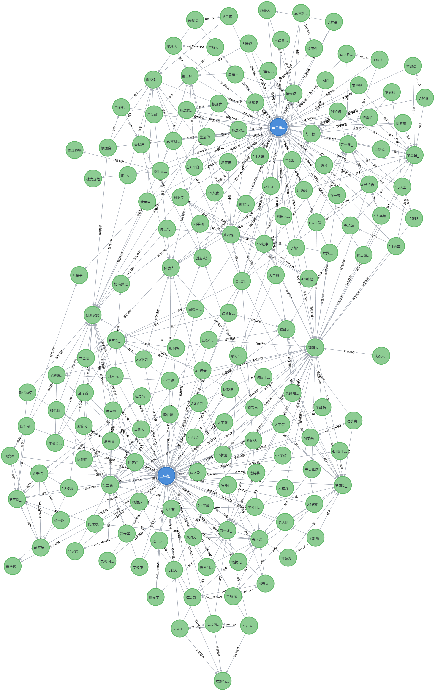

## Design and Evaluation of a Question-answering System Based on Knowledge Graph-augmented Large Language Models in K-12 Artificial Intelligence Curriculum

This is the offcial repo for the paper "[Design and Evaluation of a Question-answering System Based on Knowledge Graph-augmented Large Language Models in K-12 Artificial Intelligence Curriculum]".

  

###
It is worth noting that our article is still in the review stage.
In order to protect our intellectual property, we do not provide a nanny introduction of system implementation,
only the dataset and core code of evaluation.
Of course, by reading our article, you can see how our system is implemented.

### Requirement
* Python = 3.11.xx;
* Pytorch = 2.3.1+cu121;
* You can run it in the [mynotebook](https://modelscope.cn/my/mynotebook) on modelscope for quick evaluation purposes.  

### AI Curriculum Knowledge Graph 

We invited two experts in educational technology to extract knowledge from the AI textbooks for Grade 3, [Upper](Guangzhou_K-12_AI_Curriculum_Textbooks/Third_Grade_Upper.pdf) and [Lower](Guangzhou_K-12_AI_Curriculum_Textbooks/Third_Grade_Lower.pdf) in Guangzhou (Kappa=0.812). Following the seven-step methodology  in Protégé software, we constructed the ontology model and ultimately established a KG ontology for the AI curriculum, comprising eight categories of entities and five types of semantic relations. 

  

Subsequently, the curriculum ontology is imported into the Neo4j graph database and represented as a KG. Including 730 nodes, 2114 relationships.

- [AICKG_csv](AI_Curriculum_Knowledge_Graph/AICKG.csv)
- [AICKG_json](AI_Curriculum_Knowledge_Graph/AICKG.json)

  

### Dataset
We provide the data to make it easy for the reader to reproduce our evaluation results. 

en:
- [AIC_ThirdGrade123_en](Dataset/AIC_ThirdGrade123_en.json)
- [AIC_ThirdGrade1098_en](Dataset/AIC_ThirdGrade1098_en.json)

zh:
- [AIC_ThirdGrade123_zh](Dataset/AIC_ThirdGrade123_zh.json)
- [AIC_ThirdGrade1098_zh](Dataset/AIC_ThirdGrade1098_zh.json)

### Citation
Waiting for the result of the review.
